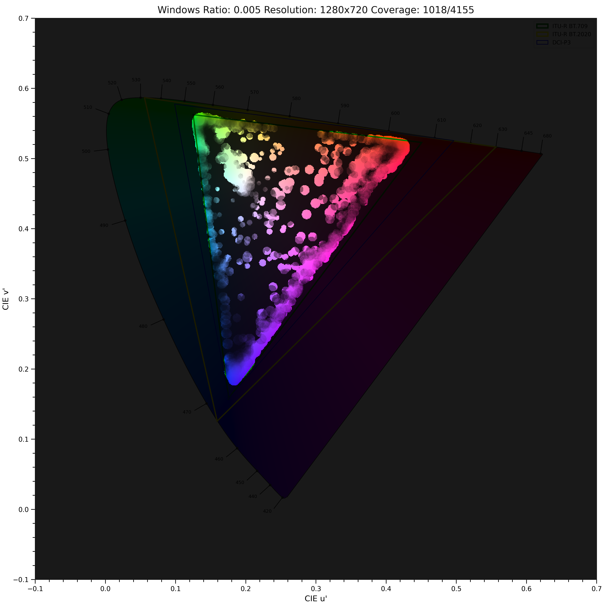

# MBVAT: Most Basic Vision Agent Testing

This project aims at providing a most basic visual agent testing.
It testing the basic grounding of the visual agent, including the following aspects:

- Recognition: how good can model recognize the object in pixel level?
- Localization: how good can model localize the object in pixel level?

## Run

Here is a sample to test color of the model:

```bash
python -m mbvat.main --test color --model qwen2vl --base-url http://localhost:8000/v1 --save-path results
```

Here is a sample to test localization of the model:

```bash
python -m mbvat.main --test localization --model qwen2vl --base-url http://localhost:8000/v1 --save-path results
```

Here is a sample to test colorful localization of the model:

```bash
python -m mbvat.main --test localization_colorful --model qwen2vl --base-url http://localhost:8000/v1 --save-path results
```

## Results Example

### Localization Test Results
Here is a sample results you will find in your localization test results:

This shows three parameters in title:
- Windows Ratio: the ratio of the object to be localized against the whole image.
- Resolution: the resolution of the tested image.
- Correctness: Corrected / Total Number of the tested images.

Each grid's color shows the correctness of the localization of the object in this grid.
The number in each grid shows the minimum Delta E (CIE 2000) between the foreground and the background.

### Color Test Results
Here is a sample results you will find in your color test results:

This picture shows the failed color test results.
The big "Triangle" shows the CIE 1976 color space.
We make a gray mask on top of color space.
The brighter the color, the better the model can recognize it.


## Citation
If you find this project useful, please kindly cite it in your publications.

```bibtex
@misc{mbvat,
  author = {Yaxi Lu},
  title = {MBVAT: Most Basic Vision Agent Testing},
  year = {2021},
  publisher = {GitHub},
  journal = {GitHub repository},
  url = {https://github.com/luyaxi/MostBasicVLMTesting}
}
```